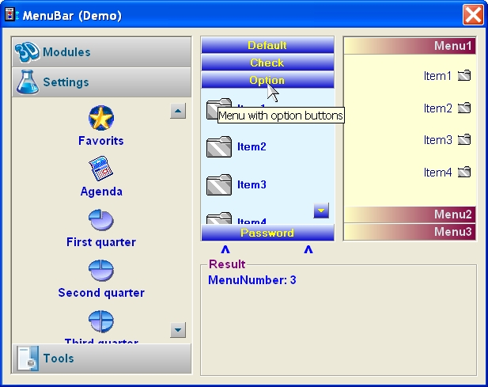



## MenuBar control

### Description

A old one but redesigned so it can go for a while. I found on internet a MenuBar control from Robert L. Kubelka. But this is completely redesigned and i add a lot of functions and settings.
 
### More Info
 

             |
---                |---
**Submitted On**   |2008-01-20 02:00:00
**By**             |[Ben Vonk](https://github.com/Planet-Source-Code/PSCIndex/blob/master/ByAuthor/ben-vonk.md)
**Level**          |Intermediate
**User Rating**    |4.8 (38 globes from 8 users)
**Compatibility**  |VB 6\.0
**Category**       |[Custom Controls/ Forms/  Menus](https://github.com/Planet-Source-Code/PSCIndex/blob/master/ByCategory/custom-controls-forms-menus__1-4.md)
**World**          |[Visual Basic](https://github.com/Planet-Source-Code/PSCIndex/blob/master/ByWorld/visual-basic.md)
**Archive File**   |[MenuBar\_co2132961122008\.zip](https://github.com/Planet-Source-Code/ben-vonk-menubar-control__1-71021/archive/master.zip)

